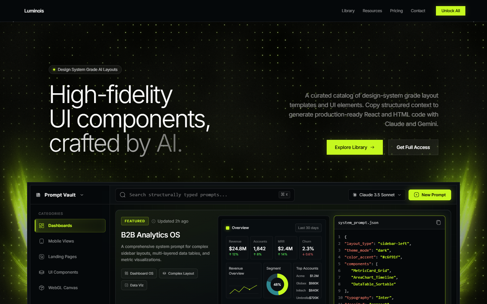

# 💎 Luminois | Premium AI Component Scaffolding Vault

> A designer-crafted scaffolding vault and design system template for generating production-ready SaaS dashboards, mobile apps, and high-fidelity interfaces using structured AI prompts.



Luminois moves beyond "AI slop" by offering structured, system-driven templates. By defining strict structural parameters and design system tokens, it guides LLMs (like Claude 3.5 Sonnet and Gemini 1.5 Pro) to output code that respects professional layout rhythms, typography hierarchies, and component spacing on the first generation.

---

## ✨ Features

- **🌐 Edge-to-Edge Fluid Backgrounds**: Features interactive, full-screen WebGL backgrounds using Unicorn Studio shaders.
- **⚡ High-Performance Flashlight Hover**: Custom radial hover lighting effects optimized with event delegation to guarantee a buttery-smooth 60fps rendering speed.
- **🌀 Scroll-Triggered GSAP Animations**: Fluid entry transitions and stagger effects built with GreenSock Animation Platform.
- **💎 Custom Brand Identity**: Re-branded as **Luminois** with a custom Prism logo system splitting layout definitions.
- **💻 Production-Ready Outputs**: Built as a responsive React + Vite + Tailwind CSS Single Page Application.

---

## 🛠️ Technology Stack

- **Framework**: React 18 (Vite)
- **Styling**: Tailwind CSS & PostCSS
- **Animations**: GSAP (GreenSock Animation Platform) & ScrollTrigger
- **WebGL Background**: Unicorn Studio WebGL Shader Scene
- **Icons**: Iconify Web Components (`solar` outline library)
- **Router**: React Router DOM v6

---

## 🚀 Getting Started

### 1. Clone & Install
Install the packages required to run the development server:
```bash
npm install
```

### 2. Run the Development Server
Spin up the local hot-reloaded development environment:
```bash
npm run dev
```
Open **[http://localhost:5173/](http://localhost:5173/)** in your browser.

### 3. Build for Production
Compile and optimize the project assets for deployment:
```bash
npm run build
```
Vite will output the optimized static bundle into the `dist/` directory.

---

## 📁 Directory Structure

```
Luminois/
├── index.html                 # App entry html
├── package.json               # Package dependencies & scripts
├── tailwind.config.js         # Tailwind variable overrides
├── screenshot.png             # Visual preview of Luminois
└── src/
    ├── main.jsx               # React entry point
    ├── App.jsx                # Global router and optimized mousemove listener
    ├── index.css              # Styling rules, keyframes, and flashlight layers
    ├── components/
    │   ├── hero/
    │   │   ├── LandingHero.jsx # Hero headers, branding copy, and UnicornScene
    │   │   └── HeroMockup.jsx  # Interactive glassmorphic dashboard mockup
    │   ├── layout/
    │   │   ├── GridSystemLayout.jsx # Fixed vertical grid lines and custom navigation
    │   │   └── SharedFooter.jsx     # Complex interactive footer with logo
    │   └── ui/
    │       ├── SectionFrame.jsx     # Dot-cornered layout sections
    │       └── TextAnimations.jsx   # GSAP and CSS text effects
    └── pages/
        ├── LandingPage.jsx    # Primary landing page showing prompt vaults
        ├── LibraryPage.jsx    # Filterable categories and library cards
        ├── PricingPage.jsx    # Purchasing tiers and checkout options
        ├── UnlockPage.jsx     # Checkout unlock screen
        ├── ResourcesPage.jsx  # Documentation, guides, and integrations
        └── ContactPage.jsx    # User inquiries page
```

---

## 📄 License
This template is open-source and available under the MIT License.
